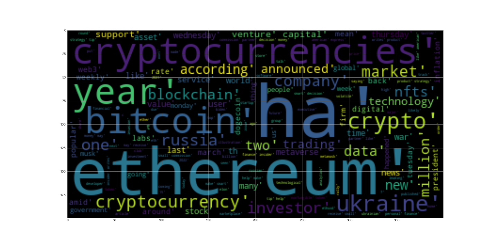
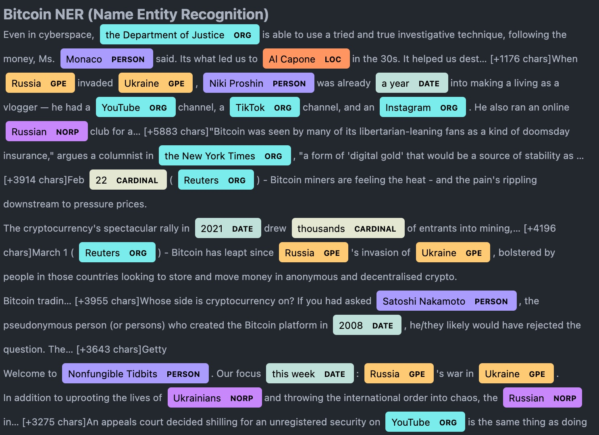

# CryptoNews-Sentiment-Analysis

## Summary 

The Following Notebook consists of three parts to with several NLP techniques applied on Cryptocurrency related news. The analysis is focused on the two major cryptocurrencies of today Bitcoin and Ethereum.

The notebook is split into the following sections :

- Sentiment Analysis from the collected news article texts
- Frequency analysis and WordCloud based on the news article text
- Name Entity Recognition analysis and rendering based on the collected data.

All data was collected from the [NewsAPI](https://newsapi.org/) service

## Results and Observation

The sentiment analysis shows that Bitcoin has an overall higher positive mean sentiment score than Ethereum , however the compound score suggest Ethereum has the higher average score of 14.5% vs 5.7% for Bitcoin as of the 2nd Week of March 2022.

Bitcoin Sentiment Summary Table

|       |   compound |   positive |   negative |    neutral |
| ----: | ---------: | ---------: | ---------: | ---------: |
| count | 100.000000 | 100.000000 | 100.000000 | 100.000000 |
|  mean |   0.057926 |   0.069720 |   0.049930 |   0.880340 |
|   std |   0.435918 |   0.069763 |   0.063435 |   0.087292 |
|   min |  -0.895700 |   0.000000 |   0.000000 |   0.627000 |
|   25% |  -0.273200 |   0.000000 |   0.000000 |   0.834750 |
|   50% |   0.000000 |   0.062000 |   0.000000 |   0.891500 |
|   75% |   0.401900 |   0.099000 |   0.083000 |   0.940750 |
|   max |   0.910000 |   0.301000 |   0.265000 |   1.000000 |

Ethereum Sentiment Summary Table

|       |   compound |   positive |   negative |    neutral |
| ----: | ---------: | ---------: | ---------: | ---------: |
| count | 100.000000 | 100.000000 | 100.000000 | 100.000000 |
|  mean |   0.145759 |   0.079060 |   0.042080 |   0.878830 |
|   std |   0.442748 |   0.069754 |   0.064156 |   0.085209 |
|   min |  -0.913600 |   0.000000 |   0.000000 |   0.627000 |
|   25% |  -0.064375 |   0.000000 |   0.000000 |   0.835250 |
|   50% |   0.177900 |   0.072000 |   0.000000 |   0.887000 |
|   75% |   0.510600 |   0.125000 |   0.066250 |   0.935000 |
|   max |   0.862500 |   0.290000 |   0.312000 |   1.000000 |

Below is an example of the WordCloud from Ethereum thats shows the most frequent word mentions from all the news articles collected.

An Example of Bitcoin Name Entity Recognition shows Russian and Ukraine appearing in a number of articles as it relates to todays news and how allows one to further dive into the subject to understand how these named entities are related to bitcoin in the context of the media.

